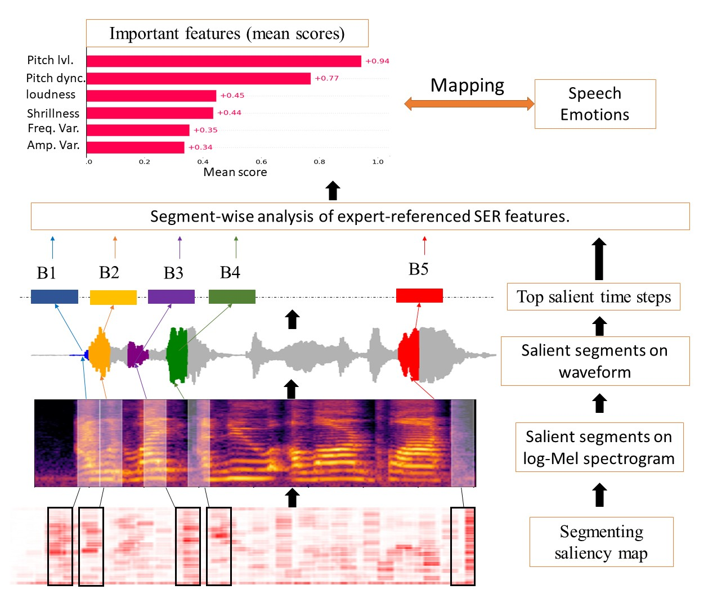

<div align="center">

# BEYOND SALIENCY Explanation


</div>

Beyond saliency: Enhancing explanation of speech emotion recognition with expert-referenced acoustic cues [[**paper**](https://arxiv.org/abs/2511.11691)]


Current saliency-based methods, adapted from vision, highlight spectrogram regions but fail to show whether these regions correspond to meaningful acoustic markers of emotion, limiting faithfulness and interpretability. We propose a framework that overcomes these limitations by quantifying the magnitudes of cues within salient regions. This clarifies “what” is highlighted and connects it to “why” it matters, linking saliency to expert-referenced acoustic cues of speech emotions.

Experiments on benchmark SER datasets show that our approach improves explanation quality by explicitly linking salient regions to theory-driven speech emotions expert-referenced acoustics. Compared to standard saliency methods, it provides more understandable and plausible
explanations of SER models, offering a foundational step towards trustworthy speech-based affective computing.


## Reproduce our results
```Beyond Saliency``` is currently under active development, but it should generalize to most speech-emotion datasets, producing saliency maps enriched with relevant acoustic-context cues.
 
### Project Structure
```
src
├── Models
│   ├── checkpoint
│   ├── SER_data.py
│   ├── trainSER.py
│   ├── README.md
│   └── utils.py
├── Notebooks
│   ├── BB_TESS.ipynb
│   ├── Crema-D.ipynb
│   └── data_Viz.ipynb
└── XAI
    ├── xai_main.py
    ├── exp_analysis.py
    ├── features.py
    ├── supplies.py
    ├── xAIultils.py
│   ├── README.md
    └── BeyondSaliency.ipynb
```

#### `src/Models`
Black-Box implementation for Speech Emotion Recognition (SER). Here you can replace the existing DNN SER model with other DNN architecture.
- **checkpoint/** – Saved model weights and training checkpoints, for fast installation.
- **SER_data.py** – Data loading and preprocessing utilities for SER datasets. In case you want to use another SER dataset, you just need to add your own functions and classes in this file to replace our dataset. 
- **trainSER.py** – Train a CNN (ResNet-like) for Speech Emotion Recognition on precomputed spectrograms.
- **utils.py** – Shared helper functions (metrics, audio processing, etc.).
- **README.md** – Model-specific documentation and further usage notes.

#### `src/Notebooks`
Exploratory analysis and experimentation.
- **BB_TESS.ipynb** – Experiments and analysis on the TESS dataset.
- **Crema-D.ipynb** – Experiments and analysis on the CREMA-D dataset.
- **data_Viz.ipynb** – Dataset statistics and feature visualizations.

#### `src/XAI`
Explainable AI (XAI) components for interpreting SER models with Beyond Saliency framework. 
- **xai_main.py** – Entry point for generating explanations.
- **exp_analysis.py** – Quantitative and qualitative explanation analysis.
- **features.py** – Feature extraction and attribution handling.
- **supplies.py** – Supporting utilities for XAI workflows.
- **xAIultils.py** – Common helper functions for explanation methods.
- **README.md** – framework-specific documentation and further usage notes.
- **BeyondSaliency.ipynb** – Notebook exploring advanced XAI methods beyond saliency maps.


## Installation

### 1. Install Dependencies
Make sure to install all required packages:
```shell
  $pip install -r src/requirements.txt
   ```

### 2. Download the Datasets
Download the dataset from your chosen data source (e.g., Kaggle) and place it inside the project directory.

 #### Toronto emotional speech set (TESS)
```python
import kagglehub

# Download latest version
path = kagglehub.dataset_download("ejlok1/toronto-emotional-speech-set-tess")

print("Path to dataset files:", path)

```
#### Crowd Sourced Emotional Multimodal Actors Dataset (CREMA-D)

```python
import kagglehub

# Download latest version
path = kagglehub.dataset_download("ejlok1/cremad")

print("Path to dataset files:", path)
```
### 3. Run data processing
Make sure to use the correct data path and provide the parameters for your dataset. Example command for the TESS dataset:

```python src/Models/SER_data.py --data_path ./TESS_df.pkl --dataset_name TESS --sample_rate 16000 ```

You can replace ```./TESS_df.pkl```, ```TESS```, and ```16000``` with your dataset’s file path, name, and sampling rate respectively.


### 4. Run Model training
Train the model using the processed dataset; Example command for the TESS dataset:


```python src/Models/trainSER.py --df_path data/TESS_df.pkl --batch_size 32 --epochs 50 --lr 3e-4 --checkpoint src/Models/checkpoint/best_model_tess.pth```

### 5. Run the Explanation generation using Beyond Saliency framework
Generate the explanation of a selected dataset, XAI_methods (CRP, OS, or CRP OS ) and a selected emotions (e.g., happy sad neutral); an example command for TESS dataset:

```python -m XAI.xai_main --data_setnames Crema-D --XAI_methods GradCAM --emotions angry```

Alternatively, you can use the Jupyter Notebook located at ```src/XAI/BeyondSaliency.ipynb```.

If you find ```Beyond Saliency``` framework useful for your research, please consider citing our [paper](https://arxiv.org/abs/2511.11691):
### 📃 Citation
```
@misc{nasr2025saliencyenhancingexplanationspeech,
      title={Beyond saliency: enhancing explanation of speech emotion recognition with expert-referenced acoustic cues}, 
      author={Seham Nasr and Zhao Ren and David Johnson},
      year={2025},
      eprint={2511.11691},
      archivePrefix={arXiv},
      primaryClass={cs.LG},
      url={https://arxiv.org/abs/2511.11691}, 
}
```

## ACKNOWLEDGMENTS
This work is associated with the Transregional Collaborative Research Centre (TRR) 318 “Constructing Explainability” and funded by Bielefeld University.

## License

This project is licensed under the **GPL-3.0 License**.  
See the [LICENSE](LICENSE) file for details.

